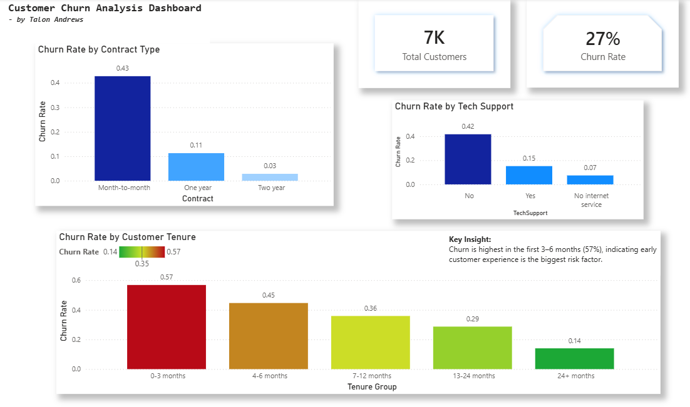
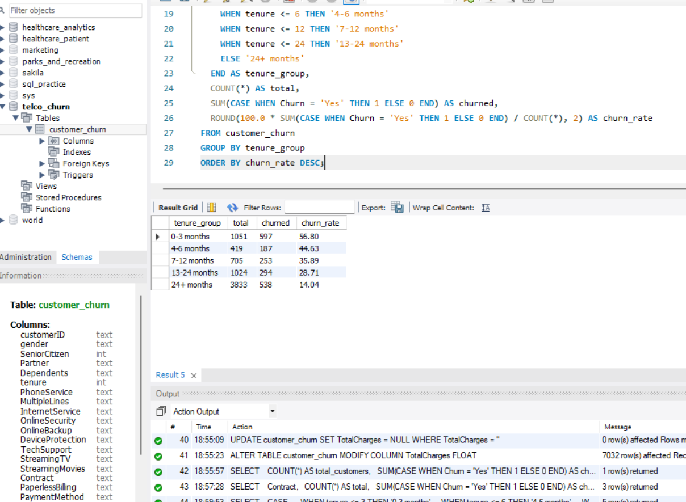

## 📊 Customer Churn Analysis

This project analyzes customer churn behavior using SQL and Power BI to identify key drivers of customer retention.

---

## 🎯 Objective

To understand:
- Which customers are most likely to churn  
- When churn occurs  
- What factors contribute to customer loss  

---

## 🛠️ Tools Used

- SQL (MySQL) – data cleaning and analysis  
- Power BI – dashboard creation and visualization  

---

## 📈 Key Insights

- Month-to-month contracts have the highest churn (~43%)  
- Churn is highest in the first 3 months (~57%)  
- Customers without tech support churn significantly more (~42% vs ~15%)  

---

## 💡 Business Recommendations

- Improve onboarding in the first 90 days  
- Encourage tech support adoption  
- Incentivize longer-term contracts  

---

## 📷 Dashboard

---

## 🧮 SQL Analysis

---

## 👤 About Me

I am transitioning into data analytics with a background in healthcare. This project demonstrates my ability to clean data, analyze trends, and communicate insights using SQL and Power BI.
